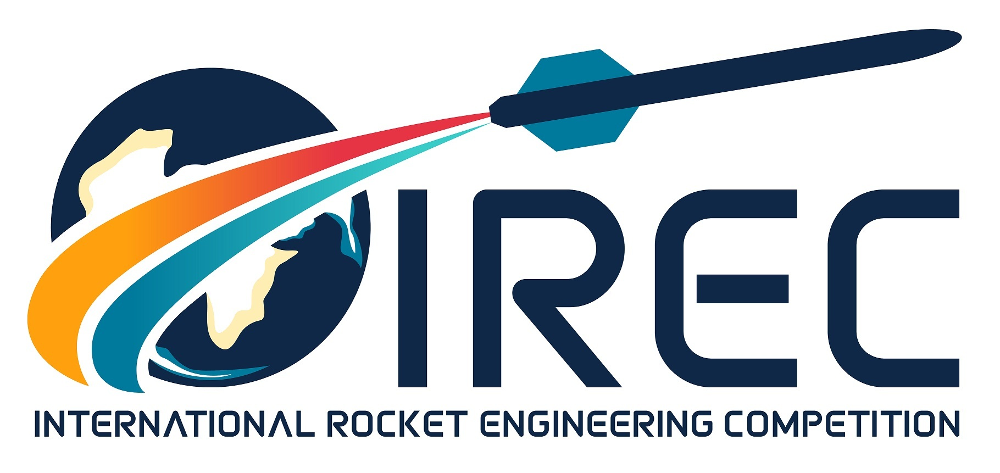

# GCS

    
    
    

Code repository for RMIT HIVE's IREC competition team rocket GCS (**Ground Control Station**) data ingestion and visulisation software.

🇦🇺 🦘 

<!-- TODO Make a monochrome png for logos. Consider https://simpleicons.org/ -->

    
    
    

## Contents

### Documentation

- [Setup](docs/setup.md)
- [Usage](docs/usage.md)
- [Pendant Emulator Quick Refference](docs/pendant_emulator.md)
- [System Design](docs/system_design.md)
- [Development](docs/development.md)
- [Glossary](docs/glossary.md)

### Notes

- [Brainstorming](notes/brainstorming.md)
- [Data](notes/data.md)

## Description

The Ground Control Station (GCS) is RMIT HIVE's computer control system for GSE control and avionics communication and visualisation. The core of the GCS is a single computer running SRAD software with SRAD LoRa radio hardware peripherals. The SRAD software converts raw serial input from physical radio interfaces into human readable output for efficient system monitoring for the GCS operator, and aesthetic visualisations for non-technical viewers. The GCS operator will see when any of our systems are having issues with alert and warning readouts so they can make an informed GO/NO-GO call very quickly. Spectators and other team members will have access to several different views detailing all telemetry from both GSE and avionics systems.

## Credit

| Name | Role | Year |
| --- | --- | --- |
| Freddy Mcloughlan (`mcloughlan`)  | GCS backend software engineer | 2025 |
| Amber Taylor (`s4105951`)  | GCS frontend developer | 2025 |
| Caspar O'Neill (`s3899921`)  | GCS QA engineer & API integration | 2025 |
| Anuk Jayasundara (`s3899921`)  | GCS frontend developer | 2025 |
| Nathan La (`s4003562`)  | GCS data visualisation programmer | 2025 |
| Jonathan Do (`s4003025`)  | GCS UI/UX Designer | 2025 |

## Development components

This project was built using the following tools, languages and systems.

- Radio commuincation:
    - [LoRa](https://en.wikipedia.org/wiki/LoRa) with both COTS and SRAD hardware
- Multithreaded data ingestion server
    - Written in C++
    - Built with [ZeroMQ](https://zeromq.org/) for IPC communication
    - IPC Data serialisation with [Google's Protocol Buffers](https://protobuf.dev/)
- Multithreaded CLI based process manager
    - Written in Python
    - Includes a device emulator for internal unit tests that attaches from the hardware layer to create a fake unix device file at `/dev/`

Example CLI interface using [retro term](https://github.com/Swordfish90/cool-retro-term) because it's cool. Front end interface will be added before competing
