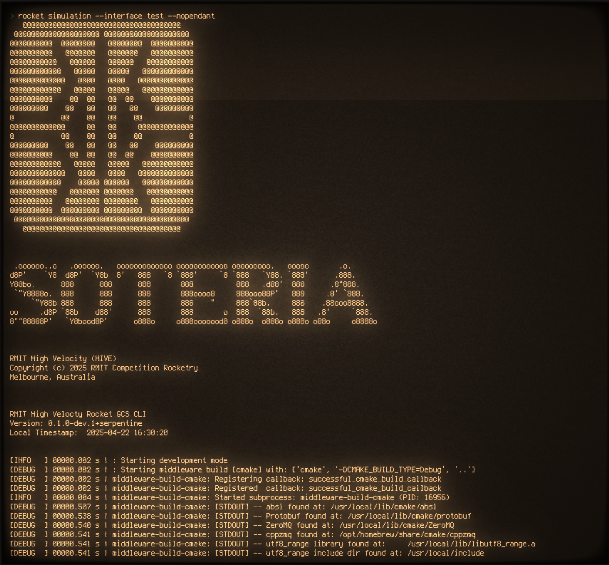

# GCS

Code repository for RMIT HIVE's IREC competition team rocket GCS (**Ground Control Station**) data ingestion and visulisation software.

<!-- TODO Make a monochrome png for logos -->

---

<!-- https://github.com/Ileriayo/markdown-badges -->

## Contents

### Documentation

- [Setup](docs/setup.md)
- [Usage](docs/usage.md)
- [Pendant Emulator Quick Refference](docs/pendant_emulator.md)
- [Application Layers](docs/application_layers.md)
- [Development](docs/development.md)

### Notes

- [Brainstorming](notes/brainstorming.md)
- [Data](notes/data.md)

---

## Development components

This project was built using the following tools, languages and systems.

- Radio commuincation:
    - [LoRa](https://en.wikipedia.org/wiki/LoRa) with both COTS and SRAD hardware
- Multithreaded data ingestion server
    - Written in C++
    - Built with [ZeroMQ](https://zeromq.org/) for IPC communication
    - IPC Data serialisation with [Google's Protocol Buffers](https://protobuf.dev/)
- Multithreaded CLI based process manager
    - Written in Python
    - Includes a device emulator for internal unit tests that attaches from the hardware layer to create a fake unix device file at `/dev/`

Example CLI interface using [retro term](https://github.com/Swordfish90/cool-retro-term) because it's cool. Front end interface will be added before competing