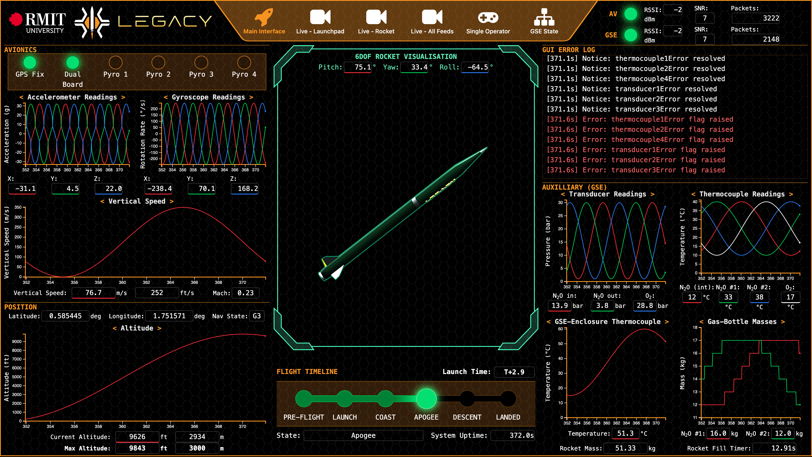

    
    
    
    <!--  -->

Repository for RMIT HIVE's rocketry GCS (**Ground Control Station**). 

**Named after Soteria, the Greek goddess of safety and deliverance from harm.**

  
  

## Contents

### Documentation

- [Setup](docs/setup.md)
- [Usage](docs/usage.md)
- [Pendant Emulator Quick Reference](docs/pendant_emulator.md)
- [System Design](docs/system_design.md)
- [Development](docs/development.md)
- [Glossary](docs/glossary.md)

<!-- ### Notes

- [Brainstorming](notes/brainstorming.md)
- [Data](notes/data.md) -->

## Description

The GCS, known as SOTERIA, is HIVE's computer control system for GSE control, avionics communication, and data visualisation. The core of the GCS is a single computer running SRAD software with SRAD LoRa radio hardware peripherals. All OSI layers in our networking stack above the physical protocol are SRAD for use with our Australis (avionics) ecosystem. The software converts raw serial input from physical radio interfaces into human-readable output for efficient system monitoring by the GCS operator and visualisations for observers. We use a WebSocket and a protocol buffer based IPC API to communicate with our GCS services. Our web frontend is fully SRAD aside from industry-standard libraries. The GCS operator can see if any system is performing sub-optimally via alert and warning readouts, so they can make an informed GO/NO-GO call quickly. Spectators and other team members have access to several different views detailing all telemetry from both the GSE and avionics systems

## Credit

| Name | Role | Year |
| --- | --- | --- |
| Freddy Mcloughlan (`mcloughlan`)  | GCS backend software engineer | 2025 |
| Amber Taylor (`s4105951`)  | GCS frontend developer | 2025 |
| Caspar O'Neill (`s3899921`)  | GCS QA engineer & API integration | 2025 |
| Anuk Jayasundara (`s3899921`)  | GCS frontend developer | 2025 |
| Nathan La (`s4003562`)  | GCS data visualisation programmer | 2025 |
| Jonathan Do (`s4003025`)  | GCS UI/UX designer | 2025 |
| Tristan Le (`trist4nl3`) | GCS simulation integration | 2025 |

## Software Development Components

This project was built using the following tools, languages and systems.

- Radio commuincation:
    - [LoRa](https://en.wikipedia.org/wiki/LoRa) with both COTS and SRAD hardware
- Multithreaded data ingestion server
    - Written in C++
    - Built with [ZeroMQ](https://zeromq.org/) for IPC communication
    - IPC Data serialisation with [Google's Protocol Buffers](https://protobuf.dev/)
- Multithreaded CLI based process manager
    - Written in Python
    - Includes a device emulator for internal system tests that attaches from the hardware layer to create a fake unix device file at `/dev/`

## Screenshots

> Web interface (main view)

> CLI (nobody but me looks at this)