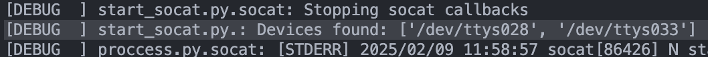
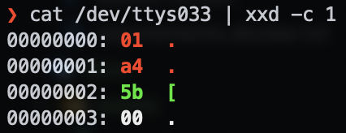
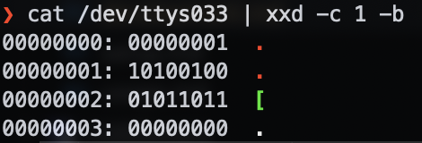

# Development notes

## Device Ports

### Device Emulation 

Example output from `socat` at startup. This shows what the device names are

```terminal
2025/02/06 20:53:44 socat[56067] N PTY is /dev/ttys012
2025/02/06 20:53:44 socat[56067] N PTY is /dev/ttys01
```

And when you write to them

```terminal
$ echo "Hello Serial" > /dev/ttys012
$ echo "Hello Serial" > /dev/ttys01
```
```terminal
2025/02/06 21:08:47 socat[56254] N write(7, 0x126814000, 13) completed
2025/02/06 21:08:53 socat[56254] N write(7, 0x126814000, 13) complete
```

Please note that both fake serial devices are linked, but when you read from one the buffer is cleared. That means that you use one as the 'fake device' and the other can just be for montitoring because nothing will steal the bytes going to it from the other linked device

### Reading Bytes

As we're not within the ascii table range, but within the entire range of bytes (0-255) we can't use screen or any ascii rendering method. You need to view the data in hex or binary.

Get the device port as the **second** listed device in the debug logs:



Then use `xxd` on unix systems (This may need to be installed). Use the `-b` flag for binary instead of hex if needed. The `-c 1` argument will do one byte per line. 




---

[Home](../README.md)