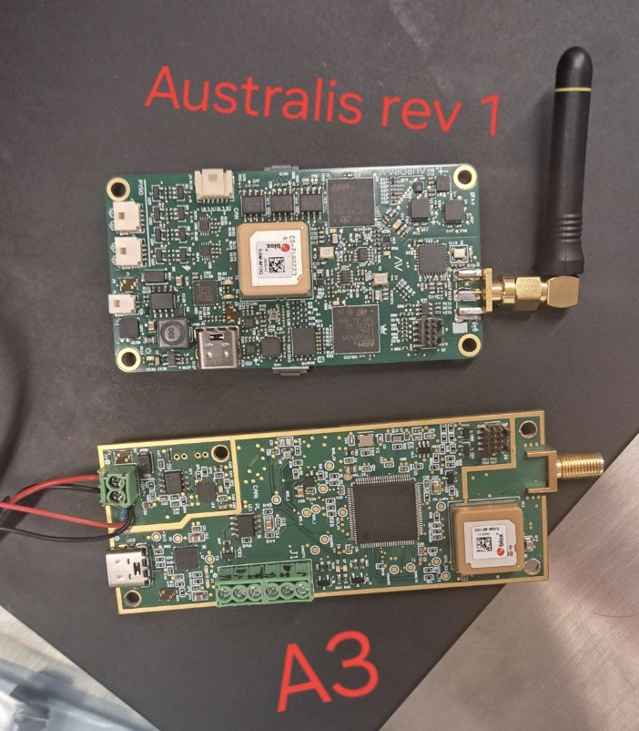

# Glossary

Rocktry definitions for HIVE

## Rockets

| Rocket Name/Program | Description & Relevance |
| --- | --- |
| Legacy | IREC 2025 competition rocket. The best rocket - Jono |
| Aurora | AURC 2024 competition rocket|

## Acronyms

| Acronym | Definition | Description & Relevance |
| --- | --- | --- |
| HIVE | High Velocity | Rocketry club name |
| [RMIT](https://www.rmit.edu.au/) | Royal Melbourne Institute of Technology | You can guess this one |
| [IREC](https://www.soundingrocket.org/2025-irec.html) | International Rocket Engineering Competition | A competition we are competing in |
| GCS | Ground Control Station | Our mission control / telemetry visualisation system on the ground |
| GSE | Ground Service Equiptment | Gas bottles, solenoids, anything that fills the rocket |
| COTS | Commercial Off The Shelf | Classification for rocket parts |
| SRAD | Student Researched And Designed | Classification for rocket parts |

## Definitions

| Word | Definition | Description & Relevance |
| --- | --- | --- |
| [Hybrid (motor)](https://en.wikipedia.org/wiki/Hybrid-propellant_rocket) | A rocket motor that uses both solid and liquid propellant | This is our 2025 IREC motor choice |
| AV | Avionics | For flight telemetry systems |
| Australis | Our avionics ecosystem | Currently used for Legacy |
| A3 | Avionics board series  | Previously used for Aurora |
| AV2 | Avionics board series  | Currently used for Legacy |

---

[Home](../README.md)
