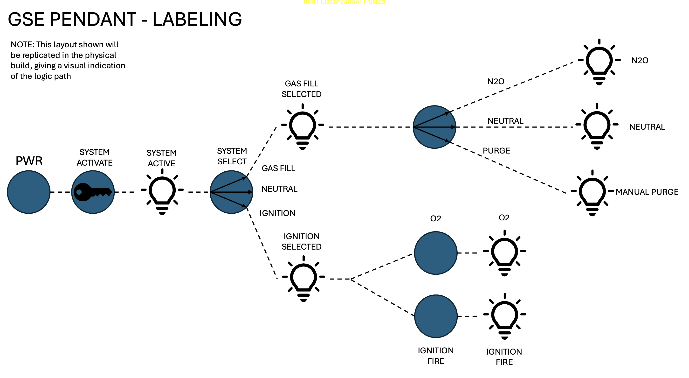
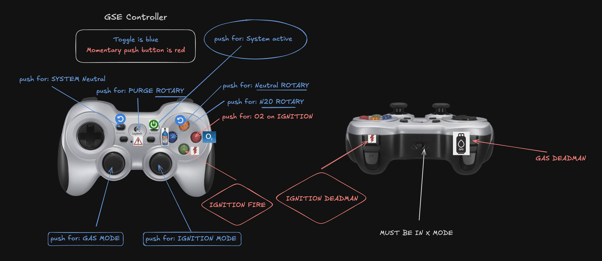

# Control Pendant Emulator

Refference schematic

## Keyboard Mapping

> [!WARNING]
> This emulator always assumes that the physical translations for mechanical inputs are as follows:
> - System is always powered on, but not activated
> - Rotary is in neutral by default
> - System select is in neutral by default
> - Push in controller stick to engage a mode and hold deadman for that mode to engage it. This emulates the spring loaded rotary switch 
>
> The SPDT and rotaries swap to whatever you last pressed on. Pressing on the same option twice will not go from true to false, but will go from true to true. Likewise, if you click on gas option then click on ignition option, it will change from gas to ignition and not enable both. 
> The SPST will just be a basic on off toggle over multiple presses

> [!CAUTION]
> Start controller in `X` mode with the switch at the front. Under no circumstances do you change this or the connection will break and a restart is required.

---

[Home](../README.md)
