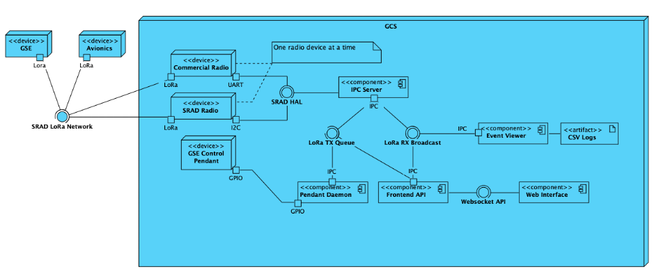

# System Design

**TODO**: Please formalise this at some point

There are 3 physical devices in the GCS system. The control pendant, radio and the computer. The control pendant is a physical tactile controller that operates the GSE. The radio is interchangeable between commercial solutions and SRAD solutions with a custom Hardware Abstraction Library (HAL).

---

WIP

see working changes on [master design Excalidraw file](https://github.com/RMIT-Competition-Rocketry/GCS/blob/main/docs/assets/master-design.excalidraw)

---

[Home](../README.md)
