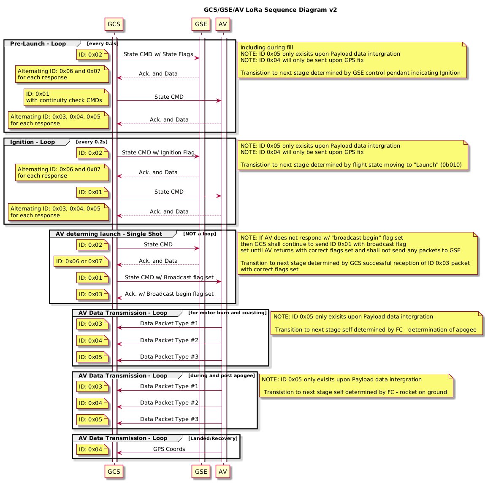

# Packet and commuincation notes

## Development roadmap

Commuincation will start with and go in order of

1. Raspi + E5 LoRa breakout
    - White Cliffs
    - UART
    - Writing to the [E5 LoRa breakout board](https://core-electronics.com.au/makerverse-lora-e5-breakout-module.html) will be with [AT commands](https://files.seeedstudio.com/products/317990687/res/LoRa-E5+AT+Command+Specification_V1.0+.pdf). Particularly [test mode](https://files.seeedstudio.com/products/317990687/res/LoRa-E5+AT+Command+Specification_V1.0+.pdf#page=52)
1. Raspi + SRAD LoRa
    - Use when ready to progress from previous setup
    - UART
    - Writing to SRAD is undefined protocol. Could just be raw packet with start and end byte. That is that the data layout in the payload is not defined with any structure as of yet.
1. PCM SRAD LoRa
    - America
    - ISA with UART fallback 

## Sequence diagram

> [!NOTE]  
> Note that data trasmmission in the sequence diagram is abstracted and data in those transmissions can and may be multiple sequential packets of different structures. Make this robust in the software design.

## RX Summary

In the final design data will come from the LoRa module and then you will get a raw packet of 16 bytes via I2C or ISA what comes directly to the PCM via GPIO. This will require a linux driver or parser script.

The strcuture of those 16 bytes will be determined by the team. See the [LoRa design spreadsheet](https://rmiteduau-my.sharepoint.com/:x:/r/personal/s3783701_student_rmit_edu_au/_layouts/15/Doc.aspx) or the image below. They have a bunch of cells explaining each byte. There is discussion on how the packet design will work. Multiple sequential packets will need to be sent when data overflows 16 bytes. This applies to TX and RX, noting that commuincation is also half duplex.

So make sure your design defines objects that are easily configurable to account for changed in packet payload structure. 

Then you can pull apart those packets and dump them stright into the database.

once we are on PCM, it must be a C type driver for initial data ingestion. I guess. 

### Hardware Input

The hardware input will come from a pendant that will have digital inputs sent to a GPIO array on the PCM. The design includes saftey checks with GPIO0/1 as that it must be high or low (forgot which one, see diagram) to indicate that the input is healthy. A flipped bit in this channel may indicate an issue with the hardware. 

Then you will need to write this data to the rocket as well.